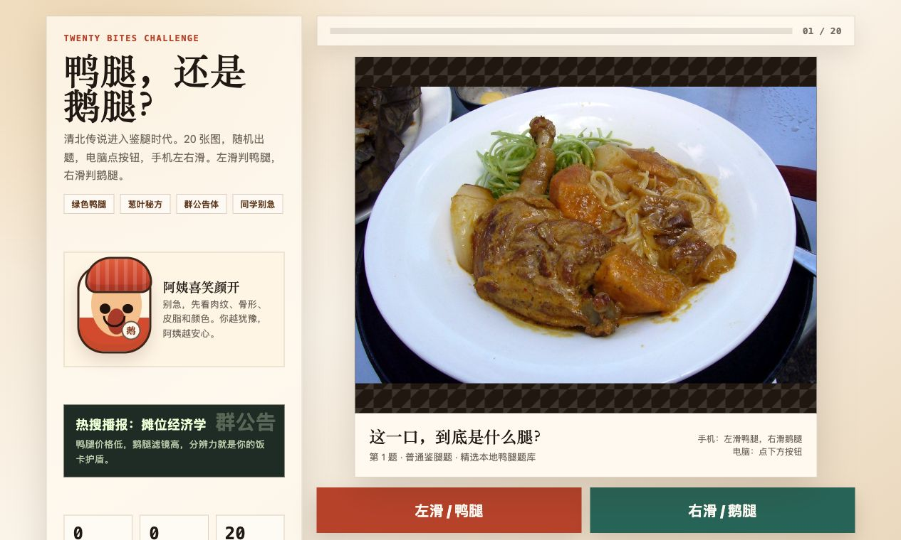
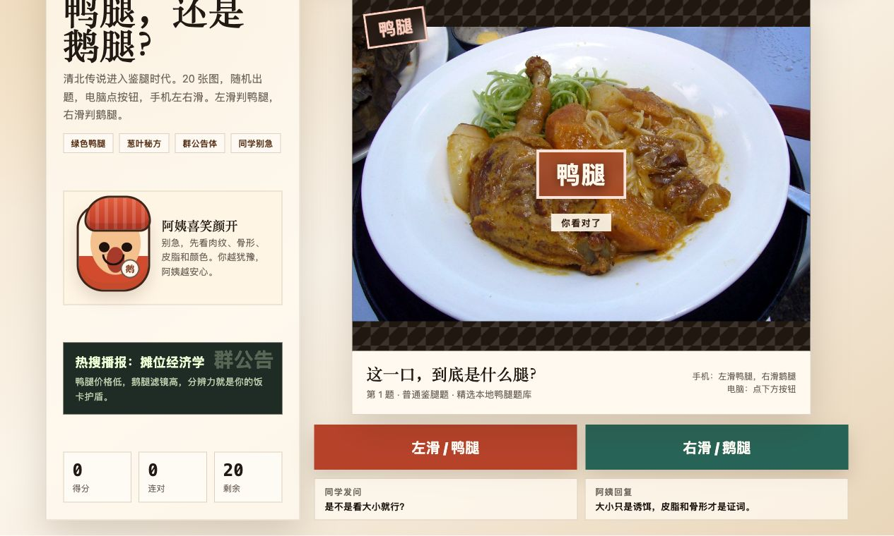
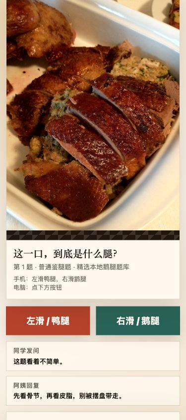
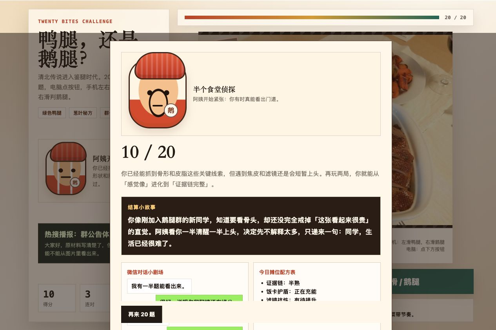

# Duck Goose Game

<p align="center">
  <a href="https://forktomorrow.github.io/duck-goose-game/"><strong>Play Online</strong></a>
  ·
  <a href="https://github.com/Forktomorrow/duck-goose-game">GitHub Repo</a>
</p>

<p align="center">
  
</p>

<p align="center">
  
  
  
  
</p>

一个围绕「鹅腿阿姨」热梗做的轻量网页小游戏：看图判断这是鸭腿还是鹅腿，20 题一局，手机左右滑，电脑点按钮。它不是严肃的食品识别模型，更像一场带梗的清北食堂传说鉴定赛。

## 在线体验

公开链接：

https://forktomorrow.github.io/duck-goose-game/

这个链接可以直接发给别人。手机、电脑、平板都打开同一份 GitHub Pages 静态页面，图片也随仓库一起托管，不依赖本机文件。

## 游戏截图

| 桌面答题 | 答题反馈 |
| --- | --- |
|  |  |

| 手机竖屏 | 结算页 |
| --- | --- |
|  |  |

## 玩法

- 手机端：左滑选鸭腿，右滑选鹅腿
- 电脑端：点击「鸭腿」或「鹅腿」按钮
- 每局 20 题，固定 10 张鸭腿/鸭类题 + 10 张鹅腿/鹅类题
- 答题后会在原图上短暂停留水印，直接告诉你这题到底是什么腿
- 结算页根据得分生成不同小故事、聊天气泡和阿姨表情

## 为什么好玩

这个项目把一个热搜梗做成了可玩的互动小测验。玩家不是读段子，而是真的参与判断：先看骨节，再看皮脂，最后怀疑人生。

游戏里穿插了绿色鸭腿、葱叶汁、蔬菜汁、白糖色、同学们、腿腿饿饿等梗元素。答得越多，阿姨状态越明显；分数越离谱，结算故事越像群聊现场。

## 设计细节

- **视觉题库更可信**：题库经过人工筛选，尽量保留能看到真实鸭/鹅腿或清楚烧鸭/烧鹅实体的图片。
- **不靠门头猜答案**：剔除了饭店招牌、建筑外观、菜单插画、活体动物和明显无关食物。
- **每局不重复**：题目按 `group` 去重，同一局不会抽到重复图片。
- **鸭鹅比例均衡**：每局强制抽取 10 鸭 + 10 鹅，不让随机数把游戏变成单边题。
- **加载更稳**：题图全部本地化到仓库，开局预加载本局 20 张图，减少黑屏和远程图源失效。
- **手机优先**：竖屏布局、滑动手势、大按钮和短反馈时间都按移动端分享场景设计。

## 技术实现

项目是一个零后端静态网页应用：

- `docs/index.html`：GitHub Pages 入口
- `docs/duck-goose-game.html`：游戏主页面
- `docs/duck-goose-assets/final50/`：精选本地题库图片
- `docs/readme-assets/`：README 展示截图
- `outputs/`：本地交付版本，与 `docs/` 保持同步

核心逻辑包括：

- 预加载本局 20 张图片
- 按类型抽取 10 鸭 + 10 鹅
- 用 `group` 做题目去重
- 图片加载异常时优先按同类型替换
- CSS/JavaScript 实现滑动、按钮、反馈水印、梗文案和结算页

## 本地预览

```bash
python3 -m http.server 8766 --directory docs
```

然后打开：

```text
http://127.0.0.1:8766/
```

## 部署

本项目通过 GitHub Pages 部署：

- Branch: `main`
- Source folder: `/docs`
- Public URL: https://forktomorrow.github.io/duck-goose-game/

更新 `docs/` 后推送到 `main`，GitHub Pages 会自动刷新线上版本。

## 项目定位

这是一个适合放在个人主页里的小型互动作品：轻量、完整、能直接分享，有明确梗背景，也有完整的移动端交互和静态部署链路。
